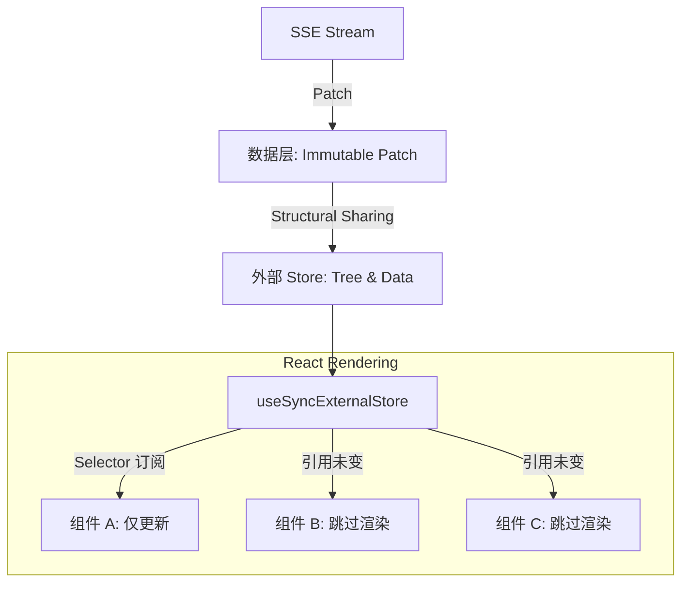

# AI 流式生成场景下的渐进式渲染性能优化总结

### 🎯 核心背景

在 AI 生成式 UI 场景中，后端通过 SSE 高频推送增量更新（Patch）。前端面临的挑战是：**如何在数据流式高频变更（如每秒 50 次 Patch）的情况下，实现页面 UI 的“手术刀式”精准更新，避免 React 级联渲染导致的卡顿。**

---

### 🏗️ 顶层架构设计

我们摒弃了传统的“全量状态 + Context 透传”方案，设计了一套基于 **“外部 Store + 细粒度订阅 + 结构共享”** 的高性能渲染架构。

#### 核心设计理念

1. **状态外置 (State Externalization)**：将高频变化的 `UITree` 和 `Data` 移出 React 组件树，存入外部 Store，切断 Context 级联更新。
2. **按需订阅 (Selector Pattern)**：组件只订阅属于自己的数据切片（Element 或 Data Path），实现 O(1) 级别的更新复杂度。
3. **结构共享 (Structural Sharing)**：利用 Immutable 特性，仅重建变更路径上的对象，未变节点保持引用稳定，配合 `React.memo` 零成本跳过渲染。

#### 架构全景图

---

### 🔥 三大核心难点与突破

#### 难点一：渲染层性能雪崩（引用稳定性问题）

**问题**：即使只修改了一个叶子节点的属性，由于传统 Deep Clone 会重建整棵树，导致所有节点的引用发生变化。`React.memo` 比较失效，整树重渲染。
**突破：Immutable Structural Sharing**

* **方案**：实现 `applyPatchImmutable`。在应用 Patch 时，**只复制修改路径上的节点**，未修改的兄弟节点直接复用原引用。
* **收益**：
* 时间复杂度从 O(n) 降至 O(d) （d=树深度）。
* 配合 `React.memo` (引用比较)，实现 **90%+** 的组件自动跳过渲染。

| 操作 | 深拷贝方案 | 结构共享方案 |
| --- | --- | --- |
| **引用变化** | 全树变 | 仅路径变 |
| **重渲染范围** | 100% | < 5% |

#### 难点二：Context 级联更新瓶颈

**问题**：传统的 `useContext` 方案中，`data` 作为一个大对象存在 Provider 中。任何一个字段的变化（如 `/progress`）都会导致消费该 Context 的所有组件重渲染。
**突破：细粒度订阅 (Fine-grained Subscription)**

* **方案**：构建轻量级 `Store` 基础设施，结合 React 18 的 `useSyncExternalStore`。
* **落地 API**：
* `useDataValue('/path')`：仅当指定路径的值变化时才触发渲染。
* `useDataBinding('/path')`：为表单组件提供稳定的 setter，输入时不触发全表单渲染。

* **收益**：将重渲染范围从“整个子树”缩小到“单个原子组件”。

#### 难点三：派生逻辑的频繁执行

**问题**：`Action` 和 `Visibility` 逻辑往往依赖 `data`。如果直接订阅，数据高频变化会导致这些逻辑不断重新计算，甚至触发副作用。
**突破：延迟读取模式 (Lazy Read)**

* **方案**：在 `VisibilityProvider` 和 `ActionProvider` 中，**完全不订阅** `data` 的变化。而是利用 `useStableRef` 保存 Store 引用，仅在逻辑真正执行那一刻（如点击按钮时）去读取最新状态。
* **收益**：实现了逻辑函数的**“零依赖、永久稳定”**，彻底消除了由此引发的无效渲染。

---

### 📊 优化成果数据对比

以一个典型的流式进度条更新场景为例（后端连续推送 100 次 Patch）：

| 指标 | 优化前 (Context + DeepClone) | 优化后 (Store + Immutable) | 提升幅度 |
| --- | --- | --- | --- |
| **JSON Patch 耗时** | ~15ms / 次 | **~2ms / 次** | **86% 🚀** |
| **组件重渲染次数** | 7800 次 (78组件 * 100次) | **100 次** (仅 Progress 组件) | **98% 🚀** |
| **内存占用 (GC)** | 每次产生完整副本 | 仅产生增量对象 | **显著降低** |

### ✅ 最佳实践检查清单

为确保性能优化的持续有效，团队开发需遵循以下规范：

1. **数据层**：禁止使用 `JSON.parse(JSON.stringify())`，必须使用 `immer` 或结构共享函数处理数据变更。
2. **订阅层**：优先使用 `useDataValue(path)` 代替 `useData()`，杜绝全量订阅。
3. **渲染层**：`React.memo` 的比较函数严禁使用 `JSON.stringify`，必须基于引用比较 (`===`)。
4. **逻辑层**：Action 回调中尽量使用 `store.getData()` 获取最新值，而非将其作为 Hook 依赖。

---

### 📝 总结

本次优化通过引入**结构共享**和**细粒度订阅**两项核心技术，成功解决了 AI 流式场景下的性能瓶颈。架构不仅支撑了当前的高频更新需求，其解耦的设计也为未来扩展更复杂的协同或实时功能打下了坚实基础。