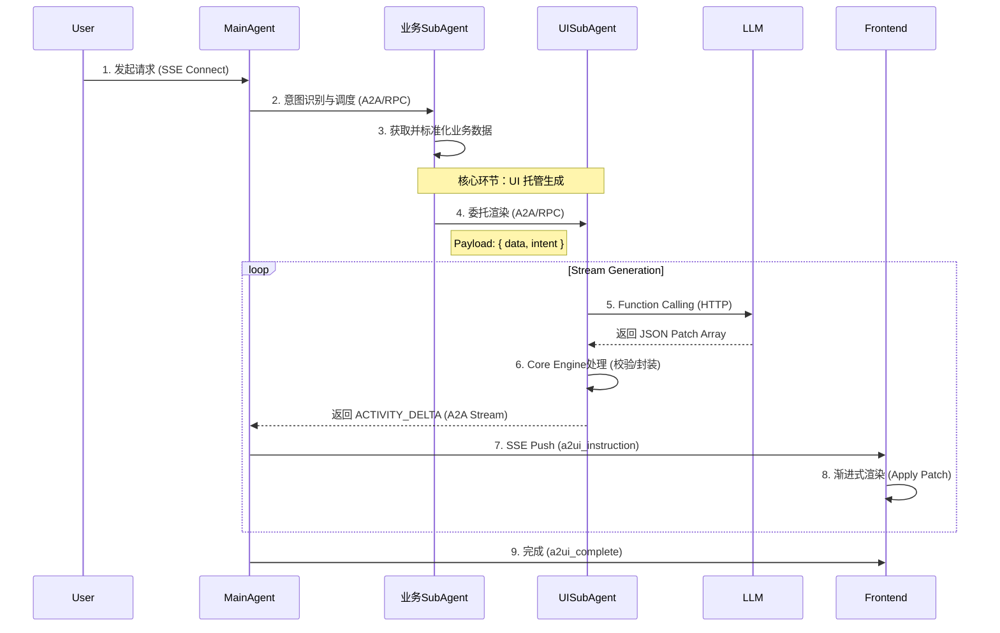

# 生成式UI渲染引擎后端落地解决方案 (AG-UI Protocol)

本方案基于 Google A2UI 理念与 AG-UI 协议，构建支持 JSON Patch Delta 流式渐进式渲染的后端工作流。通过引入独立的 **UISubAgent**，将 UI 生成流程（Prompt 拼装、LLM 调用、校验、兜底）与业务逻辑彻底解耦，解决各业务 Agent 重复建设及标准不统一的问题。

## 一、 整体工作流设计

### 系统分层架构图 (ASCII)

```text
+-----------------------------------------------------------------------------------------------+
|                                  Client Side (Frontend)                                       |
|   +---------------------------+                       +-----------------------------------+   |
|   |     ActivityRenderer      | <--- Sync Schema ---  | ComponentRegistry (UI Catalog)    |   |
|   +-------------^-------------+                       +-----------------------------------+   |
+-----------------|-----------------------------------------------------------------------------+
                  | SSE Stream (a2ui_instruction)
+-----------------|-----------------------------------------------------------------------------+
|                 |                  Server Side (Backend)                                      |
|   +-------------|-------------------------------------------------------------------------+   |
|   |   Gateway Layer                                                                       |   |
|   |   [ API Gateway / SSE Connection Manager ]                                            |   |
|   +-------------|-------------------------------------------------------------------------+   |
|                 v                                                                             |
|   +---------------------------------------------------------------------------------------+   |
|   |   Orchestration Layer (编排层)                                                        |   |
|   |   +-------------------------------------------------------------------------------+   |   |
|   |   | Main Agent (Intent Recognition & Session Management)                          |   |   |
|   |   +---------------------------------------+---------------------------------------+   |   |
|   +-------------------------------------------|-------------------------------------------+   |
|                                               | A2A Dispatch                                  |
|   +-------------------------------------------v-------------------------------------------+   |
|   |   Agent Layer (代理层)                                                                |   |
|   |                                                                                       |   |
|   |   +-----------------------+   A2A (Data+Intent)    +------------------------------+   |   |
|   |   |   Business SubAgent   | ---------------------> |   UI Generation SubAgent     |   |   |
|   |   |   (Domain Logic)      |                        |   (Rendering Engine)         |   |   |
|   |   +-----------+-----------+                        |  +------------------------+  |   |   |
|   |               |                                    |  | Core Engine            |  |   |   |
|   |               |                                    |  | - Prompt Engine        |  |   |   |
|   |               |                                    |  | - Stream Processor     |  |   |   |
|   |               |                                    |  | - Patch Generator      |  |   |   |
|   |               |                                    |  | - Schema Validator     |  |   |   |
|   |               |                                    |  +-----------+------------+  |   |   |
|   |               |                                    +--------------|---------------+   |   |
|   +---------------|---------------------------------------------------|-------------------+   |
|                   | RPC                                               | HTTP                  |
|   +---------------v-----------------------+            +--------------v---------------+       |
|   |   Infrastructure Layer (基础层)       |            |   External Services          |       |
|   |   +-------------------------------+   |            |   +----------------------+   |       |
|   |   | MCP Tools (Data Fetching)     |   |            |   | LLM Model (Inference)|   |       |
|   |   +-------------------------------+   |            |   +----------------------+   |       |
|   |   +-------------------------------+   |            +------------------------------+       |
|   |   | Catalog Manager (Metadata)    |   |                                               |
|   |   +-------------------------------+   |                                               |
|   +---------------------------------------+                                               |
+-----------------------------------------------------------------------------------------------+
```

### 模块层级说明

*   **Gateway Layer**: 负责连接保持与协议转换 (HTTP <-> SSE)。
*   **Orchestration Layer**: 
    *   **Main Agent**: 系统的总控大脑，负责意图识别、任务分发和会话管理。
*   **Agent Layer**:
    *   **Business SubAgent**: 领域专家，负责业务逻辑处理和数据准备。
    *   **UI Generation SubAgent**: 视觉专家，独立的渲染引擎服务。
        *   **Core Engine**: 内部核心组件，包含 Prompt 组装、流式处理、Patch 生成与校验。
*   **Infrastructure Layer**:
    *   **MCP Tools**: 标准化的工具集，用于连接外部数据源。
    *   **Catalog Manager**: 管理 UI 组件元数据和 Prompt 模板。

核心链路：**意图识别 -> 业务数据获取 -> UISubAgent接管 -> 增量协议封装 -> 前端渐进渲染**

### 核心时序图


### 流程总览

1.  **请求接入**：建立 SSE 连接，初始化会话。
2.  **意图识别**：Main Agent 解析用户需求，提取实体。
3.  **数据获取**：业务 SubAgent 调度 MCP 工具获取业务数据（Flight, Hotel 等）。
4.  **UI 托管 (核心)**：业务 SubAgent 将数据委托给 `UISubAgent`，由其注入 Catalog Prompt，驱动 LLM 生成 `ACTIVITY_DELTA` (JSON Patch)。
5.  **协议封装**：封装标准 SSE 事件 (`a2ui_instruction`) 推送前端。
6.  **渐进渲染**：前端引擎解析 Patch，实时更新 React 组件树。

### 分环节详细设计

#### 1. 请求接入与会话管理
*   **职责**：处理鉴权、会话 ID 生成。
*   **输出**：推送 `session_init` 事件。

#### 2. 意图识别与实体抽取
*   **职责**：Main Agent 识别意图 (e.g., `flight_search`)。
*   **Catalog**：**不注入**。避免干扰意图判断。

#### 3. 工具调度与业务数据获取
*   **职责**：业务 SubAgent 调用 MCP 获取原始业务数据。
*   **处理**：数据清洗与标准化 (Standardized Business Data)。
*   **Catalog**：**不注入**。

#### 4. 委托 UISubAgent 生成 UI Delta (核心)
*   **职责**：将业务数据转化为 UI 结构，全生命周期管理 UI 生成。
*   **输入**：标准化业务数据 + 渲染意图 (Intent)。
*   **执行**：`UISubAgent` 自动加载 Catalog Prompt，调用 LLM 基于 Function Calling 生成 JSON Patch 操作。
*   **输出**：流式 `ACTIVITY_DELTA` 片段。

#### 5. SSE 协议封装与传输
*   **职责**：Main Agent 接收 `UISubAgent` 输出，封装为 AG-UI 协议事件。
*   **事件定义**：
    *   `session_init`: 会话初始化。
    *   `a2ui_instruction`: UI 增量指令 (Payload 为 `ACTIVITY_DELTA` 结构)。
    *   `a2ui_complete`: 生成结束。
    *   `error`: 异常通知。
    *   `markdown_fallback`: 降级兜底。

#### 6. 前端渐进式渲染
*   **职责**：前端 `ActivityRenderer` 接收指令，应用 JSON Patch 更新 `ComponentRegistry` 渲染树。

---

## 二、 组件 Catalog 与 Prompt 工程方案

### 核心原则：Prompt 即 Catalog
后端不再维护独立的 Catalog 配置文件，而是直接使用前端 `catalog-to-prompt.ts` 生成的 System Prompt。确保后端生成的 UI 指令 100% 符合前端组件规范。

### Catalog 注入流程
1.  **构建时/配置期**：前端运行 `generateCatalogPrompt({ templateMode: 'a2ui' })` 生成标准 Prompt 模板。
2.  **运行时**：`UISubAgent` 加载该 Prompt 模板，作为 System Message 的一部分。

### Prompt 结构示例 (A2UI 模式)
```markdown
# TDesign A2UI Component Catalog
You can generate dynamic UI using A2UI protocol messages.

## AG-UI ACTIVITY_DELTA Format
When generating UI updates, use the AG-UI ACTIVITY_DELTA message format:
{
  "type": "ACTIVITY_DELTA",
  "messageId": "unique_id",
  "activityType": "json-render-main-card",
  "patch": [
    {"op": "add", "path": "/elements/element-id", "value": {...}}
  ]
}

## Available Components
### Button
- `label`: string
- `action`: string | { name: string, params: object }
...
```

---

## 三、 LLM 生成保障：Function Calling 强约束

放弃纯文本生成，使用 Function Calling 强制 LLM 输出合规的 JSON Patch 结构。

### Function Schema 定义
```json
{
  "name": "generate_ui_patch",
  "description": "Generate UI update patches based on business data",
  "parameters": {
    "type": "object",
    "properties": {
      "patches": {
        "type": "array",
        "description": "List of JSON Patch operations",
        "items": {
          "type": "object",
          "properties": {
            "op": { "type": "string", "enum": ["add", "replace", "remove"] },
            "path": { "type": "string", "description": "JSON Pointer path, e.g., /elements/btn_1" },
            "value": { "type": "object", "description": "Component definition or value" }
          },
          "required": ["op", "path"]
        }
      }
    },
    "required": ["patches"]
  }
}
```

### 流式生成策略
1.  **逐帧生成**：LLM 每生成一个 `patches` 数组块，UISubAgent 即刻捕获。
2.  **协议包装**：UISubAgent 将捕获的 `patches` 封装为 `ACTIVITY_DELTA` 消息。
    ```json
    {
      "type": "ACTIVITY_DELTA",
      "messageId": "msg_123",
      "activityType": "flight-search-card",
      "patch": [ ...LLM generated patches... ]
    }
    ```

---

## 四、 UISubAgent 独立设计

`UISubAgent` 是无状态、配置驱动的通用 UI 生成代理，负责接管所有 UI 渲染任务。

### 标准接口定义

**Input (Request):**
```json
{
  "sessionId": "sess-001",
  "businessData": { ... }, // 清洗后的业务数据
  "intent": "flight_list_view", // 渲染意图
  "modelConfig": { "temperature": 0.1 }
}
```

**Output (Stream):**
*   Stream Chunk: `ACTIVITY_DELTA` JSON 对象。

### 内部执行逻辑
1.  **Prompt 组装**：自动加载 System Prompt (Catalog) + User Prompt (Business Data + Intent)。
2.  **LLM 调用**：启用 Function Calling (`generate_ui_patch`)。
3.  **流式处理**：
    *   监听 LLM Delta。
    *   累积完整的 Patch 对象。
    *   **实时校验**：检查 `op`, `path` 格式，校验 `component_type` 是否在白名单。
    *   **封装推送**：输出 `ACTIVITY_DELTA`。

---

## 五、 全链路稳定性与分级兜底

### 1. 实时校验机制 (UISubAgent 内部)
*   **格式校验**：确保 `patch` 符合 RFC 6902。
*   **路径校验**：`path` 必须以 `/elements/` 或 `/data/` 开头。
*   **组件校验**：`value.type` 必须存在于 Catalog 中。

### 2. 三级兜底策略

| 级别 | 场景 | 策略 | 用户感知 |
| :--- | :--- | :--- | :--- |
| **L1: 自动修复** | 缺少非必填 Props，ID 冲突 | UISubAgent 自动补全默认值，重生成 ID | 无感知 |
| **L2: 静态模板** | LLM 生成结构严重错误 | 降级为预置的静态 JSON 模板 (Skeleton) | 展示基础 UI |
| **L3: Markdown** | UISubAgent 服务不可用/超时 | Main Agent 推送 `markdown_fallback` | 文本展示 |

---

## 六、 航班查询场景实战 (Payload 示例)

### 1. 前端请求
User: "查明天北京到上海的机票"

### 2. 后端处理
*   **业务 SubAgent**: 获取航班列表 `[{ "flight": "CA123", "price": 800 }]`。
*   **UISubAgent**: 接管数据，调用 LLM 生成 UI。

### 3. UISubAgent 输出 (SSE Stream)

**Frame 1: 创建容器**
```json
{
  "type": "ACTIVITY_DELTA",
  "messageId": "msg_1",
  "activityType": "flight_card",
  "patch": [
    { "op": "add", "path": "/elements/root", "value": { "key": "root", "type": "Card", "props": { "title": "航班查询" }, "children": [] } }
  ]
}
```

**Frame 2: 添加列表**
```json
{
  "type": "ACTIVITY_DELTA",
  "messageId": "msg_2",
  "activityType": "flight_card",
  "patch": [
    { "op": "add", "path": "/elements/list", "value": { "key": "list", "type": "Column", "children": [] } },
    { "op": "add", "path": "/elements/root/children/-", "value": "list" }
  ]
}
```

**Frame 3: 渲染数据**
```json
{
  "type": "ACTIVITY_DELTA",
  "messageId": "msg_3",
  "activityType": "flight_card",
  "patch": [
    { "op": "add", "path": "/elements/item_1", "value": { "key": "item_1", "type": "FlightItem", "props": { "no": "CA123", "price": 800 } } },
    { "op": "add", "path": "/elements/list/children/-", "value": "item_1" }
  ]
}
```
